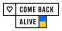

# Laravel Telescope Flusher

[](https://packagist.org/packages/tegos/laravel-telescope-flusher)
[](https://packagist.org/packages/tegos/laravel-telescope-flusher)
[](https://www.php.net/)
[](https://laravel.com/)
[](LICENSE.md)


**Laravel Telescope Flusher** is a simple package that provides an Artisan command to completely flush all Telescope
data from your database. It ensures a clean slate for debugging and monitoring while preventing execution in production
environments.

## Installation

You can install the package via Composer:

```bash
composer require tegos/laravel-telescope-flusher
```

## Usage

Once installed, you can run the following command to flush Telescope data:

```bash
php artisan telescope:flush
```

### Behavior

- ✅ Only runs in **local** environments (prevents accidental execution in production).
- ✅ Checks if **Telescope is installed** before running.
- ✅ Truncates all Telescope-related tables.
- ✅ Optimizes the `telescope_entries` table (MySQL).

### Testing

You can run tests using:

```bash
composer test
```

## Contributing

Please see [CONTRIBUTING](CONTRIBUTING.md) for contribution guidelines.

## Security

If you discover any security-related issues, please email **tegosiv@gmail.com** instead of using the issue tracker.

## Credits

- **[Ivan Mykhavko](https://github.com/tegos)**
- **[All Contributors](../../contributors)**

## License

This package is open-source software licensed under the **MIT License**. See [LICENSE](LICENSE.md) for details.

---

<p align="center">
  <a href="https://savelife.in.ua/en/donate-en/" target="_blank">
    
  </a>
</p> 
