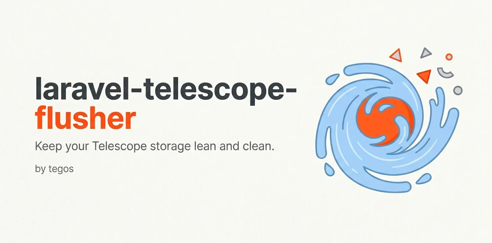
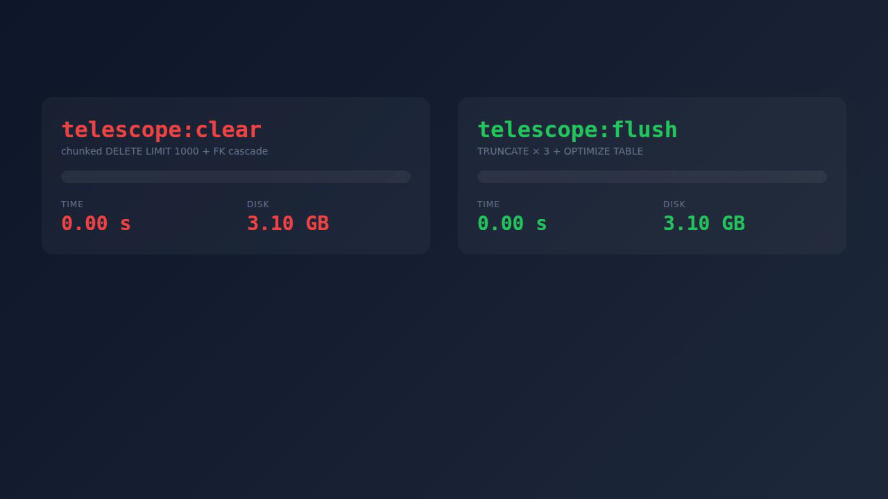

<p align="center">
  <picture>
    <source media="(prefers-color-scheme: dark)" srcset="assets/banner-dark.webp">
    
  </picture>
</p>

<p align="center">
  <a href="https://packagist.org/packages/tegos/laravel-telescope-flusher"></a>
  <a href="https://packagist.org/packages/tegos/laravel-telescope-flusher"></a>
  <a href="https://github.com/tegos/laravel-telescope-flusher/actions/workflows/tests.yml"></a>
  <a href="https://www.php.net/"></a>
  <a href="https://laravel.com/"></a>
  <a href="LICENSE.md"></a>
</p>

------

**Laravel Telescope Flusher** is a Laravel package providing an Artisan command that completely wipes all Telescope
data and reclaims disk space. Unlike `telescope:prune` (which deletes by age), it truncates every Telescope table and
runs `OPTIMIZE TABLE` on MySQL to release storage back to the engine. Production execution is blocked by design.

Useful when `telescope_entries` grows to multi-GB sizes from heavy jobs or long development sessions.

<p align="center">
  
</p>

> Benchmark on 1,000,000 entries / 3,000,000 tags (MySQL 8.0): `telescope:clear` takes
> ~150 minutes and leaves 3.1 GB locked in `.ibd` files. `telescope:flush` finishes
> in 1.21 seconds and shrinks the files to 428 KB. Reproduction script in [`bench/`](bench/).

Read more:

- [Why `telescope:clear` Is Slow and How to Reclaim Disk in Seconds](https://dev.to/tegos/PLACEHOLDER) — the benchmark deep-dive
- [Efficiently Managing Telescope Entries with Laravel-Telescope-Flusher](https://dev.to/tegos/efficiently-managing-telescope-entries-with-laravel-telescope-flusher-484a) — the original post

## Installation

**Requirements:** PHP 8.1+ · Laravel 10/11/12/13 · `laravel/telescope` installed (MySQL, PostgreSQL, SQLite supported).

You can install the package via Composer:

```bash
composer require tegos/laravel-telescope-flusher --dev
```

## Usage

Once installed, you can run the following command to flush Telescope data:

```bash
php artisan telescope:flush
```

## Behavior

- Only runs in **local** environments (prevents accidental execution in production).
- Checks if **Telescope is installed** before running.
- Truncates all Telescope-related tables.
- Optimizes the `telescope_entries` table (MySQL).

> Compared to `telescope:prune` (deletes rows older than `--hours`) and `telescope:clear` (slow row-by-row `DELETE`),
> `telescope:flush` uses `TRUNCATE` for speed and `OPTIMIZE TABLE` to reclaim disk — InnoDB does not return space to
> the OS after `DELETE`, only marks it reusable.

## Testing

You can run tests using:

```bash
composer test
```

### Running tests in Docker

```bash
docker compose up -d
docker compose exec app composer install
docker compose exec app composer test
```

## Contributing

Please see [CONTRIBUTING](CONTRIBUTING.md) for contribution guidelines.

## Security

If you discover any security-related issues, please email **tegosiv@gmail.com** instead of using the issue tracker.

## Credits

- **[Ivan Mykhavko](https://github.com/tegos)**
- **[All Contributors](../../contributors)**

## License

This package is open-source software licensed under the **MIT License**. See [LICENSE](LICENSE.md) for details.

---

<p align="center">
  <a href="https://savelife.in.ua/en/donate-en/" target="_blank">
    
  </a>
</p> 
